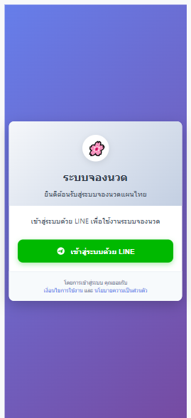
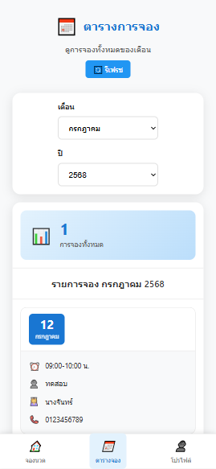
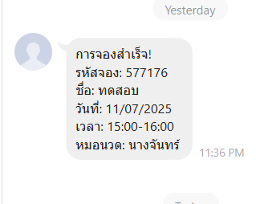

# Massage Booking System

ระบบจองนวดแบบครบวงจร ที่พัฒนาด้วย ASP.NET Core และ Blazor Server

## 📋 คำอธิบายโปรเจค

ระบบจองบริการนวดที่ประกอบด้วย:
- **Frontend**: Blazor Server Application
- **Backend**: ASP.NET Core Web API
- **Database**: SQLite
- **การรับรองตัวตน**: LINE Login Integration

## 📱 ภาพตัวอย่างระบบ

### หน้าเข้าสู่ระบบด้วย LINE


### หน้าจองบริการนวด


### หน้าดูรายการจองแยกตามเดือน/ปี


### หน้าโปรไฟล์ผู้ใช้


### การแจ้งเตือนการจองสำเร็จ


## 🏗️ โครงสร้างโปรเจค

```
myApp/
├── BlazorServer/
│   └── MassageBooking/          # Blazor Server Frontend
│       ├── Components/          # Razor Components
│       ├── Models/             # Data Models
│       ├── Services/           # Business Logic Services
│       ├── ShowImg/            # Screenshots/Demo Images
│       │   ├── 1.png          # Screenshot 1
│       │   ├── 2.png          # Screenshot 2
│       │   ├── 3.png          # Screenshot 3
│       │   ├── 4.png          # Screenshot 4
│       │   └── 5.PNG          # Screenshot 5
│       └── wwwroot/           # Static Files
├── backend/
│   └── MassageBookingApi/      # ASP.NET Core Web API
│       ├── Controllers/        # API Controllers
│       ├── Data/              # Database Context
│       ├── Models/            # API Models
│       ├── Services/          # API Services
│       └── Migrations/        # Entity Framework Migrations
└── README.md
```

## 🛠️ ความต้องการของระบบ

### Software Requirements
- [.NET 8.0 SDK](https://dotnet.microsoft.com/download/dotnet/8.0) สำหรับ Blazor Server
- [.NET 9.0 SDK](https://dotnet.microsoft.com/download/dotnet/9.0) สำหรับ Web API
- [Visual Studio 2022](https://visualstudio.microsoft.com/) หรือ [Visual Studio Code](https://code.visualstudio.com/)
- [Git](https://git-scm.com/)

### Optional Tools
- [SQLite Browser](https://sqlitebrowser.org/) สำหรับดูข้อมูลในฐานข้อมูล

## 🚀 วิธีการติดตั้งและรันโปรเจค

### 1. Clone Repository

```bash
git clone <repository-url>
cd myApp
```

### 2. ติดตั้ง Dependencies

#### สำหรับ Backend API:
```bash
cd backend/MassageBookingApi
dotnet restore
```

#### สำหรับ Frontend (Blazor Server):
```bash
cd ../../BlazorServer/MassageBooking
dotnet restore
```

### 3. ตั้งค่า Database

#### สร้าง Database และ Apply Migrations:
```bash
cd ../../backend/MassageBookingApi
dotnet ef database update
```

### 4. รันแอปพลิเคชัน

#### วิธีที่ 1: รันแยกกัน (แนะนำสำหรับ Development)

**Terminal 1 - รัน Backend API:**
```bash
cd backend/MassageBookingApi
dotnet run
```
API จะรันที่: `https://localhost:7039` หรือ `http://localhost:5000`

**Terminal 2 - รัน Frontend:**
```bash
cd BlazorServer/MassageBooking
dotnet run
```
Frontend จะรันที่: `https://localhost:7233` หรือ `http://localhost:5001`

#### วิธีที่ 2: ใช้ Batch/Shell Scripts

**สำหรับ Windows:**
```bash
cd backend
run_api.bat
```

**สำหรับ Linux/macOS:**
```bash
cd backend
chmod +x run_api.sh
./run_api.sh
```

### 5. เข้าใช้งานแอปพลิเคชัน

เปิดเว็บเบราว์เซอร์และไปที่:
- **Frontend**: http://localhost:5001
- **API Documentation**: http://localhost:5000/swagger

## 📚 คุณสมบัติของระบบ

### Frontend Features (Blazor Server)
- 🏠 **หน้าแรก**: แสดงข้อมูลทั่วไป
- 📅 **ระบบจอง**: จองบริการนวด
- 👤 **โปรไฟล์ผู้ใช้**: จัดการข้อมูลส่วนตัว
- 🔐 **เข้าสู่ระบบ**: ผ่าน LINE Login
- 📊 **Dashboard**: สำหรับดูสถิติการจอง

### Backend Features (Web API)
- 🔌 **RESTful API**: สำหรับการจัดการข้อมูล
- 🗄️ **Entity Framework Core**: ORM สำหรับฐานข้อมูล
- 📱 **LINE API Integration**: สำหรับการรับรองตัวตน
- 📋 **Swagger Documentation**: เอกสาร API อัตโนมัติ

## 🔧 การพัฒนา

### การเพิ่ม Migration ใหม่
```bash
cd backend/MassageBookingApi
dotnet ef migrations add <MigrationName>
dotnet ef database update
```

### การรัน Tests
```bash
dotnet test
```

### การ Build สำหรับ Production
```bash
# Build Backend
cd backend/MassageBookingApi
dotnet publish -c Release -o publish

# Build Frontend
cd ../../BlazorServer/MassageBooking
dotnet publish -c Release -o publish
```

## 📝 Configuration

### appsettings.json สำหรับ Backend
```json
{
  "ConnectionStrings": {
    "DefaultConnection": "Data Source=booking.db"
  },
  "LineConfig": {
    "ChannelId": "your-line-channel-id",
    "ChannelSecret": "your-line-channel-secret"
  }
}
```

### appsettings.json สำหรับ Frontend
```json
{
  "ApiBaseUrl": "https://localhost:7039"
}
```

## 🔒 Security Notes

- ไฟล์ `appsettings.Production.json` ถูกเพิ่มใน `.gitignore`
- ไม่ควร commit LINE Channel Secret ลงใน repository
- ใช้ User Secrets สำหรับข้อมูลลับในระหว่างการพัฒนา

## 🐛 Troubleshooting

### ปัญหาที่พบบ่อย

1. **Port Conflict**: ถ้า port ถูกใช้งานแล้ว ให้เปลี่ยนใน `launchSettings.json`
2. **Database Connection**: ตรวจสอบ connection string ใน `appsettings.json`
3. **CORS Issues**: ตรวจสอบการตั้งค่า CORS ใน Backend

### การ Reset Database
```bash
cd backend/MassageBookingApi
rm booking.db*
dotnet ef database update
```

## 📞 การติดต่อ

หากมีปัญหาหรือข้อสงสัย กรุณาติดต่อทีมพัฒนา

## 📄 License

โปรเจคนี้อยู่ภายใต้ MIT License